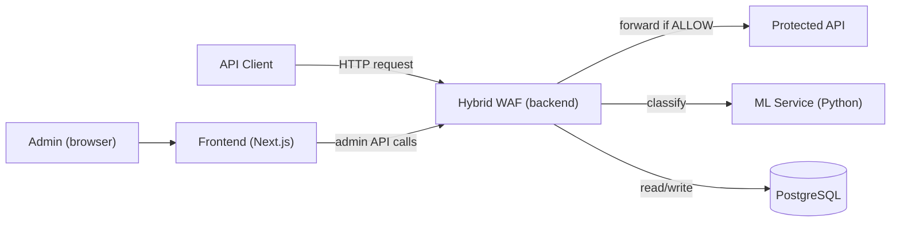
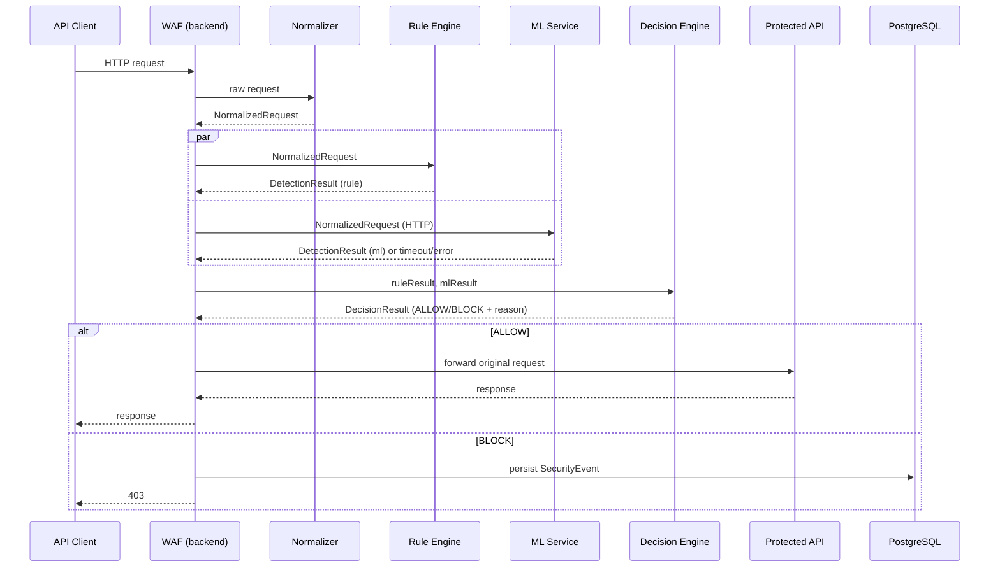
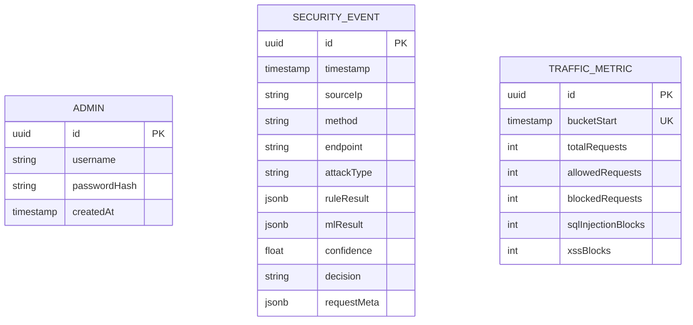

# Hybrid WAF — Architecture (Phase 1A)

Status: **Approved (2026-08-24).** ADR-1 through ADR-6 are approved — see §19 for final status, including the ADR-2 and ADR-5 clarifications. This document is the architecture reference for the MVP. Changes from here on require the same STOP-and-report process defined in `docs/CLAUDE.md` §15.

Scope is bound by `docs/CLAUDE.md` §2 (MVP scope) and §3 (non-goals). Nothing here introduces functionality outside those lists.

---

## 1. Architecture Overview

The Hybrid WAF is a reverse-proxy-style gate in front of a small demo API. Every client request is intercepted by the WAF service, normalized into a common shape, evaluated by two independent detectors (rule-based and ML), merged by a decision engine, and either forwarded to the Protected API or rejected with `403`. Blocked (and only blocked) requests are persisted as Security Events, which an authenticated Admin can review through a dashboard.

Five runtime components, matching the repository's top-level folders:

| Component | Tech | Role |
|---|---|---|
| `backend` (Hybrid WAF) | NestJS/TypeScript | WAF pipeline, decision engine, security-event persistence, admin auth + admin API |
| `protected-api` | NestJS/TypeScript | Minimal demo API sitting behind the WAF |
| `ml-service` | Python/scikit-learn | Feature extraction + ML classification, called over HTTP |
| `frontend` | Next.js/TypeScript | Admin dashboard (login, events, stats) |
| PostgreSQL | — | Stores `Admin` and `SecurityEvent` |

The WAF (`backend`) is the only component that talks to `protected-api`, `ml-service`, and PostgreSQL directly. `frontend` only ever talks to the WAF's Admin API — it never reaches `protected-api`, `ml-service`, or the database directly.

---

## 2. System Context



- **API Client**: any HTTP caller exercising the demo API. Not a system component — no code owned by this project.
- **Admin**: authenticated human operator viewing the dashboard. Also not a component — a role.

---

## 3. Component Architecture

### 3.1 Hybrid WAF (`backend`)

```text
Controller
    ↓
Application Service (WafService)
    ↓
Request Normalizer
    ↓
Detection Engines (Rule, ML) — invoked in parallel
    ↓
Hybrid Decision Engine
    ↓
Traffic Metrics recorded (every request; fire-and-forget, never awaited — §8a)
    ↓
Security Event Persistence (on BLOCK)
    ↓
Forward to Protected API (on ALLOW) / 403 response (on BLOCK)
```

Planned module boundaries (folders, not classes):

```text
backend/src/
├── waf/              # WAF controller + orchestration service; wires the pipeline together
├── request/           # RequestNormalizer + the NormalizedRequest type
├── detection/
│   ├── rule-based/    # Rule-based detection engine (interface now, detectors later)
│   └── ml/            # ML detection engine — HTTP client to ml-service
├── decision/           # HybridDecisionEngine
├── security-events/    # SecurityEvent entity, repository, service (BLOCK-only)
├── traffic-metrics/    # TrafficMetric aggregate counters (every request, fire-and-forget, §8a)
├── auth/                # Admin authentication (JWT)
├── admin/               # Admin API (list/detail events, stats)
└── common/              # shared types (NormalizedRequest, DetectionResult, DecisionResult)
```

Responsibility rule (per `docs/CLAUDE.md` §8): the WAF controller only accepts the HTTP request and returns the HTTP response. It does not normalize, detect, or decide — those live in `request/`, `detection/`, and `decision/` respectively, each independently testable and independently mockable.

### 3.2 Protected API (`protected-api`)

A separate, tiny NestJS app. Owns no security logic. Its only job is to exist as something the WAF forwards allowed traffic to, e.g. `GET /api/hello`. It is not reachable by clients directly in the intended deployment (see §17).

### 3.3 ML Service (`ml-service`)

A standalone Python HTTP service. Exposes a prediction endpoint and a health endpoint. Owns feature extraction and the scikit-learn model. Stateless per request.

### 3.4 Frontend (`frontend`)

Next.js app (App Router, client components, Tailwind — no additional UI/chart library). Talks only to the WAF's Admin API (`backend/src/admin`). No direct DB or ML access.

Built in Phase 10: `login/` (username/password → `POST /auth/login` → JWT stored in `localStorage`, per ADR-5's stateless/client-side model — there is no server session to join) and `dashboard/` (fetches `GET /admin/stats` and `GET /admin/events?pageSize=10` in parallel; renders the five stat tiles, an Attack Distribution comparison, and a Recent Security Events table; a Log out button clears the stored token client-side only, per ADR-5, with no server call). The root route (`/`) redirects to `/dashboard`, which itself redirects unauthenticated visitors on to `/login`. A `401` from either Admin API call (missing/expired/invalid token) clears the stored token and redirects to `/login`; a `503` (database unavailable) is shown as an inline banner instead of crashing the page — route protection is a client-side token check only, there is no middleware/server-side session to consult.

### 3.5 Database (PostgreSQL)

Owned exclusively by `backend`. Neither `protected-api` nor `ml-service` connect to it.

---

## 4. Core Request Flow



Stage responsibilities:

1. **WAF Entry** — controller receives the raw HTTP request (method, URL, query, params, body, headers, source IP). No inspection happens here.
2. **Extract** — pull the fields listed above out of the framework's request object into plain data.
3. **Normalize** — `RequestNormalizer` turns extracted data into the canonical `NormalizedRequest` (§5).
4. **Rule Detection** and **ML Detection** run against the same `NormalizedRequest`, in parallel (`Promise.all`), each independently.
5. **Hybrid Decision** — combines both `DetectionResult`s into one `DecisionResult` (§7).
6. **ALLOW** — the *original* request is forwarded to Protected API and its response relayed back.
7. **BLOCK** — a `SecurityEvent` is persisted and the client receives `403` with a generic body (no internal detail leaked).

---

## 5. Request Normalization

```typescript
interface NormalizedRequest {
  method: string;
  url: string;
  endpoint: string;          // path without query string
  queryParams: Record<string, string>;
  pathParams: Record<string, string>;
  body: unknown;              // parsed JSON body, or raw string if not JSON
  sourceIp: string;
  headers: Record<string, string>; // allow-listed headers only, not the full raw header set
  timestamp: string;          // ISO 8601, set at normalization time
}
```

Why normalization is needed: Rule and ML detection must see identical input, or their results aren't comparable and the Decision Engine can't reason about them consistently. Without a shared shape, each detector would parse the raw HTTP request its own way, risking inconsistent SQLi/XSS surface coverage (e.g. one checking `req.body` a different way than the other).

Consumers: `RuleDetectionEngine`, `MLDetectionEngine` (which serializes it into the ML service's request contract, §7), and `SecurityEvent` persistence (which stores a subset of it, §10).

Header allow-list (not the full header set) is deliberate — see §17 (avoid logging/forwarding sensitive headers like `Authorization` verbatim into detection/logging paths beyond what's needed).

Not implemented in this phase — interface only.

---

## 6. Rule-based Detection Architecture

```typescript
interface DetectionResult {
  classification: 'NORMAL' | 'SQL_INJECTION' | 'XSS';
  detected: boolean;
  confidence: number | null;   // rule engine may leave this null (deterministic, not probabilistic)
  reason: string;
}

interface RuleDetectionEngine {
  detect(request: NormalizedRequest): DetectionResult;
}
```

`RuleDetectionEngine` is the composition point for individual detectors (`SqlInjectionRuleDetector`, `XssRuleDetector` — implemented in Phase 5). It runs each detector against the normalized request and returns the highest-severity result. Synchronous, in-process — no external calls, so no failure-mode concerns. `DetectionResult.classification` is always one of the three enum values here — the rule engine has no "unavailable" state, unlike the ML engine (§7).

Not implemented in this phase — interface only, no rules.

---

## 7. Machine Learning Architecture

```text
NormalizedRequest
      ↓ (WAF: MLDetectionEngine)
      ↓ HTTP POST /predict
Python ML Service
      ↓
Feature Extraction
      ↓
scikit-learn Model
      ↓
{ classification, confidence }
```

**Request contract** (`backend` → `ml-service`, `POST /predict`):

```json
{
  "method": "POST",
  "endpoint": "/api/hello",
  "queryParams": { "id": "1 OR 1=1" },
  "pathParams": {},
  "body": "..."
}
```

Only the fields relevant to feature extraction are sent — not the full `NormalizedRequest` (e.g. `sourceIp` and `headers` are omitted unless a feature actually needs them).

**Response contract**:

```json
{
  "classification": "SQL_INJECTION",
  "confidence": 0.94
}
```

**ML result type (approved, ADR-2).** Unlike the rule engine, the ML engine has a genuine failure mode (the service is a separate network call), so its result is modeled as a tagged union distinct from the plain `DetectionResult` used elsewhere — `UNAVAILABLE` is a first-class outcome, never collapsed into `NORMAL`:

```typescript
type MLDetectionResult =
  | {
      status: 'AVAILABLE';
      classification: 'NORMAL' | 'SQL_INJECTION' | 'XSS';
      confidence: number;
      reason: string;
    }
  | {
      status: 'UNAVAILABLE';
      classification: null;
      confidence: null;
      reason: string; // e.g. "ML service timeout" / "ML service connection error"
    };
```

`MLDetectionEngine.detect(request: NormalizedRequest): Promise<MLDetectionResult>` returns the `AVAILABLE` variant when the ML service responds successfully with a well-formed body, and the `UNAVAILABLE` variant on timeout, connection failure, non-2xx response, or a malformed/unexpected response body.

**Timeout / error behavior (MVP fallback strategy, approved as ADR-2):**

- `MLDetectionEngine` calls the ML service with a short timeout (e.g. 1–2s, exact value configurable).
- On timeout, connection failure, non-2xx response, or malformed response: `MLDetectionEngine` returns `{ status: 'UNAVAILABLE', classification: null, confidence: null, reason: '...' }`. `UNAVAILABLE` is never represented as `NORMAL` — the Hybrid Decision Engine (§8) treats "ML has no opinion" and "ML says this is normal traffic" as distinct facts.
- The Hybrid Decision Engine still has the Rule Engine's result, so a request that's blockable by rules alone is still blocked even when ML is down. When rules report `NORMAL` and ML is `UNAVAILABLE`, the request is `ALLOW`ed — the rule engine is the deterministic fallback (see §8).
- Every ML failure is logged to application/operational logs so degraded mode is visible operationally. **A `SecurityEvent` is not created for ML unavailability by itself** — `SecurityEvent` is reserved for BLOCK decisions (§10); an unreachable ML service is an infra/ops concern, not a security incident.

**MVP trade-off, documented explicitly:** we do not fail the entire WAF closed when the ML service is unavailable. Failing closed would make all normal traffic dependent on ML service uptime, which is an unacceptable availability cost for a demo system whose deterministic rule engine is already capable of catching the MVP's target attack classes (SQLi/XSS) on its own. The rule engine is therefore the authoritative fallback whenever ML cannot vote.

Not implemented in this phase — contract only, no model.

---

## 8. Hybrid Decision Engine

```typescript
interface DecisionResult {
  classification: 'NORMAL' | 'SQL_INJECTION' | 'XSS';
  action: 'ALLOW' | 'BLOCK';
  reason: string;
}

interface HybridDecisionEngine {
  decide(
    request: NormalizedRequest,
    ruleResult: DetectionResult,
    mlResult: MLDetectionResult,
  ): DecisionResult;
}
```

Deterministic MVP strategy (updated per approved ADR-2):

```text
ruleResult.detected === true
        → BLOCK, classification = ruleResult.classification, reason = "rule match: " + ruleResult.reason

ruleResult.detected === false
  AND mlResult.status === 'AVAILABLE'
  AND mlResult.classification !== 'NORMAL'
  AND mlResult.confidence >= ML_CONFIDENCE_THRESHOLD
        → BLOCK, classification = mlResult.classification, reason = "ml match: " + mlResult.reason

ruleResult.detected === false
  AND mlResult.status === 'UNAVAILABLE'
        → ALLOW, classification = "NORMAL", reason = "rule: normal; ml: unavailable"

otherwise (ruleResult.detected === false AND mlResult reports NORMAL)
        → ALLOW, classification = "NORMAL"
```

- Rule detection is authoritative when it fires — it's deterministic and explainable, which matters for a project defense.
- ML only tips the decision when rules stay silent, and only when `status === 'AVAILABLE'` and above the confidence threshold.
- When ML is `UNAVAILABLE`, the engine never treats that as evidence of `NORMAL` traffic — it simply has one less input and falls back to the rule engine's verdict, per §7.
- `ML_CONFIDENCE_THRESHOLD` is a configurable value (env var), not hardcoded — exact default TBD at implementation time (Phase 7), not part of this architecture decision.

Not implemented in this phase — the class/interface will exist as a stub in Phase 2, real logic lands in Phase 7.

---

## 8a. Traffic Metrics (Phase 9A, ADR-7)

Immediately after `HybridDecisionEngine.decide(...)` returns, and for **every** request (both `ALLOW` and `BLOCK` — unlike `SecurityEvent`, which stays BLOCK-only per ADR-3), the WAF records a request into an aggregate counter table, `TrafficMetric`:

```text
id                  UUID, primary key
bucketStart         start of the current hour, UTC (unique)
totalRequests       incremented on every request
allowedRequests     incremented when action === 'ALLOW'
blockedRequests     incremented when action === 'BLOCK'
sqlInjectionBlocks  incremented when action === 'BLOCK' && classification === 'SQL_INJECTION'
xssBlocks           incremented when action === 'BLOCK' && classification === 'XSS'
```

This exists because the Dashboard (Phase 10, per the SRS) needs "Total Requests" and "Allowed Requests," which `SecurityEvent` alone cannot supply (it only ever holds BLOCK rows). Rather than storing one row per request (which would both violate ADR-3's intent and bloat storage for no forensic value), a single hourly-bucketed counter row is incremented atomically per request — no raw request data is read or stored here, only the `DecisionResult`'s `action`/`classification`.

**Non-blocking by design (the critical property of ADR-7):**

```text
Decision
   ↓
fire TrafficMetricsRecorder.record(decision) — NOT awaited, .catch()-guarded
   ↓
immediately: BLOCK → SecurityEventLogger (§10, awaited, unchanged) → 403
          or ALLOW → forward to Protected API
```

The metrics write is fired and the handler moves on immediately — it is never `await`ed before the ALLOW/BLOCK response is returned, and the returned promise always has an explicit `.catch()` so a rejection can never become an unhandled rejection. A slow, hung, or unreachable metrics database therefore adds **zero latency** to any request and can **never** change, delay, or weaken an already-computed ALLOW/BLOCK decision — the decision is fully resolved before the metrics promise even settles. This is a deliberately different failure-handling strategy from `SecurityEventLogger` (§10, Phase 8), which is still awaited and still gates completion of the BLOCK response — the two are independent operations with independent, intentionally different guarantees.

**Concurrency:** the increment is a single atomic Postgres statement (`INSERT ... ON CONFLICT ("bucketStart") DO UPDATE SET ... = ... + n`), not Prisma's `.upsert()` (which is two round-trips and unsafe against concurrent writers racing on the same bucket). This is correct under concurrent requests landing in the same hour — verified live under a 30-request concurrent burst with zero lost updates.

Not implemented before this phase. `GET /admin/stats` (Phase 10) will read from this table; it is not implemented yet either.

---

## 9. Protected API

Intentionally minimal. One demo route (`GET /api/hello` returning a static JSON payload) is sufficient to prove `WAF → Protected API` forwarding. No auth, no persistence, no business logic — it exists only as a forwarding target.

---

## 10. Security Logging

**SecurityEvent** is created **only on BLOCK** (per `docs/CLAUDE.md` §11 and the prompt's guidance) — normal/allowed traffic is not persisted, keeping storage bounded and keeping the dashboard focused on actual incidents. Per approved ADR-2, an `UNAVAILABLE` ML result does **not** by itself create a `SecurityEvent` — only a BLOCK decision does, and BLOCK on an ML-unavailable request can only happen via the rule engine (§8). ML unavailability is an operational/log concern, not a security event.

Fields:

```text
id            UUID, primary key
timestamp     when the decision was made
sourceIp      NormalizedRequest.sourceIp
method        NormalizedRequest.method
endpoint      NormalizedRequest.endpoint
attackType    DecisionResult.classification
ruleResult    DetectionResult (rule) — stored as JSON
mlResult      MLDetectionResult (ml) — stored as JSON; on a BLOCK caused by rules alone, this will typically show status: 'AVAILABLE' with classification: 'NORMAL', or status: 'UNAVAILABLE'
confidence    mlResult.status === 'AVAILABLE' ? mlResult.confidence : null
decision      DecisionResult.action  (always 'BLOCK' by construction, kept for clarity/future use)
requestMeta   JSON: { queryParams, pathParams, endpoint } — a redacted subset, not the raw request
```

**Deliberately not stored:** raw request body (may contain credentials/PII beyond what's needed to explain the block), full raw headers (may contain `Authorization`/`Cookie`), full querystring/path values beyond what's needed to show *why* it was flagged. Instead, `ruleResult.reason` / `mlResult.reason` and a redacted `requestMeta` should carry enough of the offending fragment (e.g. the specific query param value that matched) to explain the block without persisting unrelated sensitive fields wholesale. Exact redaction rule is an implementation detail for Phase 8, not this document.

---

## 11. Admin Architecture

```text
Admin Authentication  → auth/     (JWT login, issue/verify token)
Admin API             → admin/    (list events, event detail, attack stats)
Dashboard              → frontend/ (Login, Dashboard, Security Events, Event Detail, Attack Statistics, Detection Evaluation, Logout)
```

Admin API surface:

```text
POST /auth/login          → { accessToken }                                        — implemented, Phase 9
GET  /admin/events        → paginated SecurityEvent list (filterable by attackType, date range) — implemented, Phase 9
GET  /admin/events/:id    → SecurityEvent detail                                    — implemented, Phase 9
GET  /admin/stats         → aggregate counts (total/allowed/blocked/SQLi/XSS, from TrafficMetric, §8a) — implemented, Phase 10
```

`GET /admin/stats` reads only `TrafficMetric` (an all-time `SUM` across every hourly bucket — the table has no retention policy yet, so this is a small, cheap aggregate). It does **not** return recent events itself — the Dashboard's "Recent Security Events" panel is served by the existing `GET /admin/events?pageSize=10` instead, keeping `/admin/stats` scoped to one table and avoiding a second, duplicate query path over `SecurityEvent`.

No `POST /auth/logout` — per ADR-5, logout is a client-side token discard only; there is no server-side session/blacklist to call out to, so no logout endpoint exists.

All `/admin/*` routes require a valid JWT (see §13). `/auth/login` is the only unauthenticated admin-facing route.

---

## 12. Database Design



No foreign key between `Admin` and `SecurityEvent` — events aren't owned by a specific admin, they're owned by the system. Indexes: `SecurityEvent(timestamp)` for chronological listing/pagination, `SecurityEvent(attackType)` for the stats/filter views.

`TrafficMetric` (Phase 9A, ADR-7, §8a): aggregate-only, no FK to anything — same system-owned rationale as `SecurityEvent`. `bucketStart` is unique (one row per UTC hour); no other columns are indexed since Phase 10's `/admin/stats` is expected to read a small, bounded number of recent buckets. No retention/cleanup policy, same as `SecurityEvent` — deferred, not this phase's concern.

---

## 13. Authentication

- **Strategy (approved, ADR-5):** JWT access tokens, stateless. Chosen over server-side sessions because it needs no extra session store for a single-admin-role MVP, and it's simple to explain during a defense.
- **Password hashing:** bcrypt (or equivalent), never plaintext, never reversible encryption.
- **Token handling:** issued on `/auth/login`, sent as `Authorization: Bearer <token>` on every `/admin/*` call, verified by a NestJS guard on the `admin` module.
- **Expiration:** access tokens are short-lived — approximately 15–30 minutes (exact value configurable, not fixed by this document).
- **Logout:** client discards the token; there is no server-side blacklist/session store. Logout does **not** revoke an already-issued JWT — if the same token is presented again before it expires, it remains valid. Redis or any session infrastructure is deliberately not introduced solely to support logout.
- **MVP trade-off, documented explicitly:** a stolen/leaked token before logout stays usable until natural expiration (bounded by the 15–30 minute window above). This is accepted for the MVP because the alternative (server-side revocation) requires session/blacklist infrastructure disproportionate to a single-admin-role demo system; the short expiry bounds the exposure window instead of eliminating it.
- **Admin provisioning:** out of scope for this document how the first `Admin` row is created (seed script vs manual insert) — decide in Phase 9.

---

## 14. Repository Structure

```text
hybrid-waf/
│
├── docs/
│   ├── CLAUDE.md
│   ├── memory.md
│   └── architecture.md
│
├── backend/            # Hybrid WAF: waf, request, detection, decision, security-events, auth, admin
├── ml-service/          # Python + scikit-learn prediction service
├── protected-api/       # Minimal demo API behind the WAF
├── frontend/             # Next.js admin dashboard
│
├── docker-compose.yml    # backend, protected-api, ml-service, frontend, postgres — dev-level only
├── .env.example
├── README.md
└── .gitignore
```

Matches the structure already sketched in `docs/CLAUDE.md`; kept as four independent top-level services because they're genuinely different runtimes (two Node processes with different responsibilities, one Python process, one frontend) and the WAF/Protected-API separation is the whole point of the demo (a single merged app couldn't demonstrate "WAF sits in front of an API"). No deeper nesting or shared internal package structure — not needed at this scale.

---

## 15. Component Communication

| From | To | Protocol | Purpose |
|---|---|---|---|
| API Client | WAF (`backend`) | HTTP/JSON | All application traffic enters here |
| WAF | Protected API | HTTP/JSON | Forward allowed requests; WAF relays the response verbatim |
| WAF | ML Service | HTTP/JSON | Send `NormalizedRequest` subset, receive classification+confidence |
| WAF | PostgreSQL | TCP (TypeORM/Prisma driver) | Persist `SecurityEvent`, read for Admin API, read/write `Admin` |
| Frontend | WAF Admin API | HTTP/JSON + JWT | Login, fetch events/stats |

No component other than `backend` talks to PostgreSQL or `ml-service`. `protected-api` never talks back to `backend` except via the response it returns to the forwarded call.

---

## 16. Failure Handling

| Failure | Behavior |
|---|---|
| ML service unavailable/timeout | `MLDetectionEngine` returns `MLDetectionResult { status: 'UNAVAILABLE' }` (see §7) — never `NORMAL`; decision engine falls back to the rule engine's verdict; failure is logged operationally, no `SecurityEvent` created for the unavailability itself |
| Protected API unavailable (on ALLOW path) | WAF returns `502 Bad Gateway` to the client; not a security event, it's an infra failure |
| Database unavailable | A BLOCK decision still returns `403` to the client (blocking must not depend on logging succeeding); the persistence failure is logged server-side. Admin API calls that need the DB (events/stats/login) fail with `503` |
| Invalid/malformed request (e.g. unparseable JSON body) | Normalizer treats the unparsed body as a raw string rather than throwing — malformed input is exactly the kind of thing detectors should be allowed to see, not reject before inspection |

No retries, no circuit breakers, no distributed tracing — out of scope for an MVP demo per `docs/CLAUDE.md` §3.

---

## 17. Security Considerations

- Passwords hashed (bcrypt), never logged.
- All secrets/config (DB credentials, JWT secret, ML service URL) via environment variables; `.env.example` documents required keys, `.env` is never committed.
- `NormalizedRequest` header extraction is allow-listed (§5) so secrets in headers (e.g. `Authorization`) aren't propagated into ML requests or `SecurityEvent` storage.
- `SecurityEvent` storage deliberately excludes raw body/full headers (§10).
- `/admin/*` requires JWT; `/auth/login` is the only open admin route.
- BLOCK responses are a generic, fixed `403` body — no internal reasoning, stack traces, or detector detail leaked to the client (that detail lives only in the `SecurityEvent`, visible to authenticated admins).
- ML service communication: WAF validates the ML service's response shape before trusting it (malformed/unexpected response is treated the same as `UNAVAILABLE`, §7) — it never trusts the ML service blindly, and never lets an unavailable ML service silently widen the ALLOW surface beyond what the rule engine alone would allow.
- JWT access tokens are short-lived (§13); logout is client-side only and does not revoke a still-valid token server-side — an accepted MVP trade-off, not an oversight (§13).
- CORS (Phase 10): the WAF only enables cross-origin access for the Dashboard's own origin (`FRONTEND_URL` env var), never a wildcard; unset, no cross-origin admin API access is possible at all.
- In the intended deployment, `protected-api` is only reachable from `backend`'s network position, not directly from the internet — for local/dev demo purposes this is a documented assumption rather than an enforced network boundary (no k8s/cloud network policy work, per non-goals).

---

## 18. Technology Decisions

| Concern | Choice | Rationale |
|---|---|---|
| WAF + Protected API runtime | NestJS/TypeScript | Matches `docs/CLAUDE.md` §7; strong module system fits the layered design in §3.1 |
| ML runtime | Python + scikit-learn | Matches §7 non-goal boundary (no deep learning); scikit-learn is fast to iterate on within 20 days |
| WAF ↔ ML transport | HTTP/JSON | Simplest cross-language contract; no need for gRPC/message-queue complexity at this scale |
| Database | PostgreSQL | Given; relational fit for `Admin`/`SecurityEvent`, easy pagination/filtering for the dashboard |
| Admin auth | JWT | Stateless, no extra session infra, easy to explain in a defense |
| Dev orchestration | docker-compose | Given; dev-level only, not production-optimized (per Phase 0 constraints) |

No deviations from the stack in `docs/CLAUDE.md` §7.

---

## 19. Architecture Decision Log

| # | Decision | Status |
|---|---|---|
| ADR-1 | WAF (`backend`) and Protected API are separate NestJS processes, not one app with internal routing | **Approved** |
| ADR-2 | ML failure is represented as an explicit `UNAVAILABLE` state (never coerced to `NORMAL`); decision engine falls back to the rule engine's verdict; ML unavailability alone never creates a `SecurityEvent`. MVP trade-off: the WAF does not fail closed when ML is down, so normal traffic isn't held hostage to ML uptime — the rule engine is the deterministic fallback. See §7/§8/§10. | **Approved (clarified)** |
| ADR-3 | SecurityEvent is created only on BLOCK, not on every request | **Approved** |
| ADR-4 | SecurityEvent stores a redacted `requestMeta`, not the raw body/full headers | **Approved** |
| ADR-5 | JWT-based admin auth, stateless, short-lived access tokens (~15–30 min), no server-side logout/session store — logout does not revoke an already-issued token. MVP trade-off: exposure window on a leaked pre-logout token is bounded by expiry, not eliminated; no Redis/session infra added solely for logout. See §13. | **Approved (clarified)** |
| ADR-6 | Four independent top-level services (`backend`, `protected-api`, `ml-service`, `frontend`) rather than a merged app | **Approved** |
| ADR-7 | Aggregate traffic counters (`TrafficMetric`, hourly UTC buckets: total/allowed/blocked/SQLi/XSS) via a separate table updated atomically per-request in the WAF pipeline, not via `SecurityEvent` rows — `SecurityEvent` stays BLOCK-only (ADR-3 unchanged). The counter write is fire-and-forget: never awaited before the ALLOW/BLOCK response, always `.catch()`-guarded, so counter latency/failure can never delay or change a security decision. Decided in Phase 9A, ahead of Phase 10's Dashboard (which needs Total/Allowed Requests that `SecurityEvent` alone cannot supply). See §8a/§10/§12. | **Approved** |

Phase 1A is complete: all six ADRs are approved, ADR-2 and ADR-5 with the clarifications above. ADR-7 added in Phase 9A (2026-08-26).

---

## Self-check against the 10 review questions

1. 20-day feasible? Yes — each component is intentionally small; no unscoped infra work.
2. WAF still central? Yes — it's the only component touching `protected-api`, `ml-service`, and the DB.
3. Rule vs ML clearly separated? Yes — independent interfaces, independent modules, run in parallel, merged only in the Decision Engine.
4. Decision Engine clearly separated? Yes — own module, own interface, not embedded in the controller or either detector.
5. ML model replaceable later? Yes — `MLDetectionEngine` only depends on the HTTP contract in §7, not on any model internals.
6. Security Events queryable efficiently? Yes — indexed on `timestamp` and `attackType` for the two dashboard access patterns (list-by-recency, filter-by-type).
7. Full flow easily demoable? Yes — a single curl/browser request through the WAF exercises the entire pipeline end to end.
8. Simple enough to defend? Yes — every stage maps to one paragraph of explanation; no distributed-systems machinery.
9. Unnecessary abstractions avoided? Yes — four services matches four genuinely different runtimes; no extra internal layering beyond Controller→Service→Engine→Repository.
10. Scope creep beyond SQLi/XSS? None found — cross-checked against `docs/CLAUDE.md` §3.
